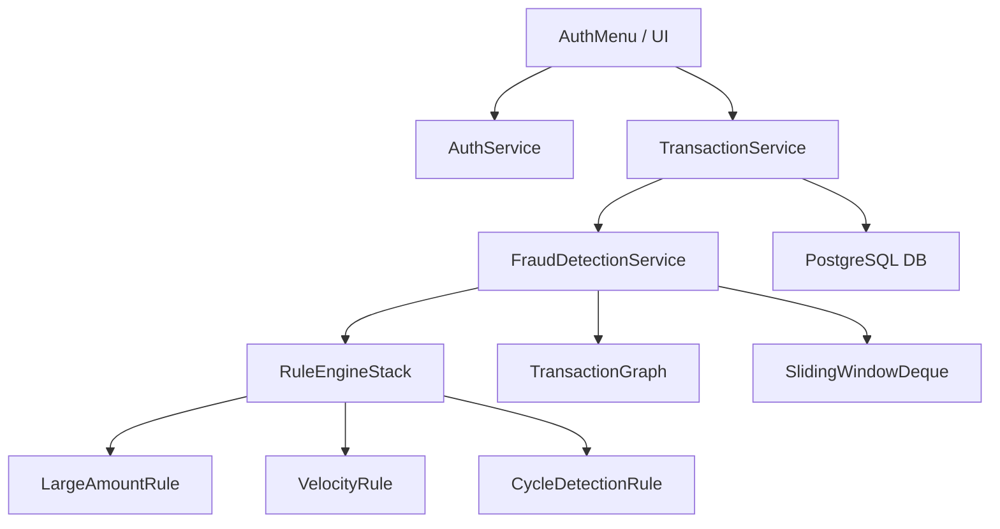

# Fraud Detection Engine (Java + DS + DBMS)

A real-time, high-performance financial fraud detection system built without the help of standard Java collections for core algorithmic logic. This project demonstrates ACID-compliant banking operations, custom data structure implementation, and rule-based risk assessment.

## 🚀 Key Features
- **Real-Time Fraud Engine**: Automated Blocking, Flagging, and Freezing based on risk scores.
- **Custom Data Structures**: 
    - `TransactionGraph`: Adjacency List for laundering cycle detection (DFS).
    - `MinHeap`: Max-Priority priority queue for Analyst alert management.
    - `SlidingWindowDeque`: Doubly Linked List for transaction velocity monitoring.
    - `RuleEngineStack`: Array-based rule evaluator.
- **ACID Security**: Multi-table transactions (User + Account) with full rollback support on failure.
- **Role-Based Access (RBAC)**: Distinct dashboards for Customers, Analysts, and Administrators.
- **Audit Logging**: Immutable system-wide security tracking.

## 🛠️ Technical Stack
- **Language**: Java 17+
- **Database**: PostgreSQL 15+ (Raw JDBC, no ORM)
- **Build Tool**: Maven / Maven Daemon (`mvnd`)
- **Architecture**: DAO Pattern + Service Layer + Singleton Connection Management.

## 📐 Architecture Diagram


## ⚙️ Setup & Run
1. **Database Setup**:
    - Create a database `fraud_engine` in PostgreSQL.
    - Run the schema located in `sql/schema.sql`.
2. **Build**:
    - Run `mvn clean install` to compile and test.
3. **Execution**:
    - Use `mvn exec:java -Dexec.mainClass="Main"` to launch the terminal-based UI.
4. **Testing**:
    - All tests are located in `src/test/java`. Run `mvn test` to verify the logic.

## 📜 Fraud Rules & Validations
| Rule | Risk Score | Action | Logic |
| --- | --- | --- | --- |
| **New Account** | 30 | FLAGGED | Account is < 24h old |
| **Velocity** | 35 | FLAGGED | > 5 txns in 60 seconds |
| **Large Amount** | 40 | FLAGGED | Transfers > $50,000 |
| **Cycle Loop** | 90 | **BLOCKED & FROZEN** | Detects Laundering Cycles (DFS) |

### 🛠️ Key Validations Checked:
- **Circular History Reset**: Analysts can clear the graph memory without deleting transactions.
- **Priority Alerts**: Alerts are sorted by **Risk Score** using a custom MinHeap (Max-Priority).
- **Automated Freezing**: Accounts are automatically frozen on 3+ unreviewed alerts or a cycle detection.
- **Data Integrity**: SQL scripts prepared for safe batch deletion of test users while respecting foreign keys.

---

## 🏗️ Why Maven (`mvn`) instead of `javac`?
You might wonder why we don't just use `javac Main.java`. Here is why Maven is essential for this project:

1. **Dependency Management**: This project uses the **PostgreSQL JDBC Driver**. Without Maven, you would have to manually download the `.jar` file and include it in your classpath every time you compile and run.
2. **Package Structure**: Since the code is organized into packages (`dao`, `service`, `ui`, `ds`), `javac` would require long, complex commands to find all the files. Maven handles this mapping automatically.
3. **Automated Testing**: Maven runs all unit and integration tests (like the `FraudIntegrationTest`) with a single command (`mvn test`), ensuring the fraud engine is stable before you even start the app.
4. **Build Lifecycle**: Maven handles cleaning old build files, compiling, and running the app in a standardized way across different computers.

---

📋 Prerequisites
They need these 3 things installed (which you already have):

1. **Java 17+ (JDK)**
2. **PostgreSQL** (Database)
3. **Maven** (Build Tool)

### Step 1: Database Setup
Make sure the PostgreSQL server is running. run these commands in the terminal:

```bash
# Log in to Postgres and create the database
psql -U postgres -c "CREATE DATABASE fraud_engine;"
# Import the schema from your project folder
psql -U postgres -d fraud_engine -f sql/schema.sql
```

### Step 2: Build & Run
In the project root directory, run:

```bash
# Compile and install
mvn clean install

# Launch the App
mvn exec:java -Dexec.mainClass="Main"
```

### 💡 Quick Summary 
| Command | What it does |
| :--- | :--- |
| `mvn clean compile` | Prepares the code for execution |
| `mvn test` | Runs the Fraud Engine against 8 security tests |
| `mvn exec:java -Dexec.mainClass="Main"` | Starts the App |

**User Roles:**
- **Customer**: To send money and trigger fraud rules.
- **Analyst**: To review high-priority heap-sorted alerts and perform Global Resets.
- **Admin**: To change the system thresholds (like the 50k limit) and view system volume.
