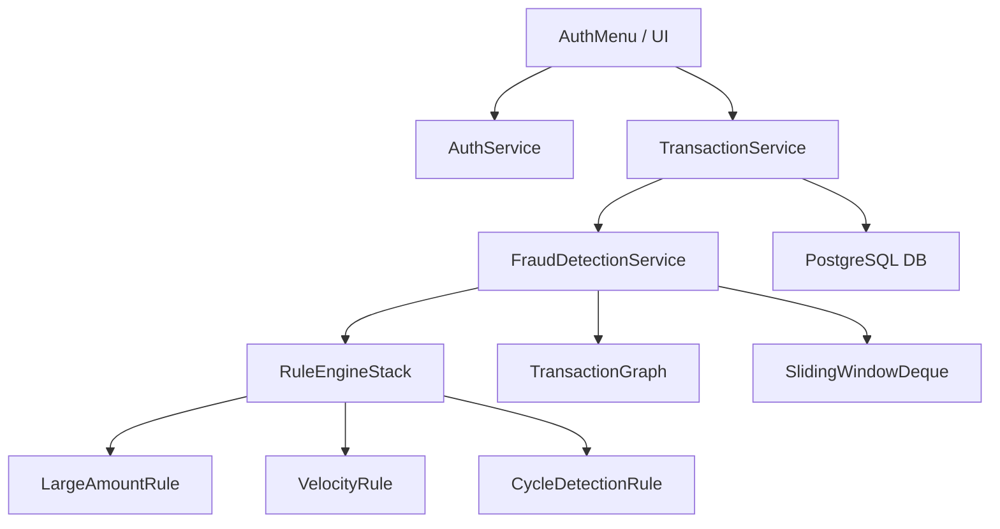

# Fraud Detection Engine (Java + DS + DBMS)

A real-time, high-performance financial fraud detection system built without the help of standard Java collections for core algorithmic logic. This project demonstrates ACID-compliant banking operations, custom data structure implementation, and rule-based risk assessment.

## 🚀 Key Features
- **Real-Time Fraud Engine**: Automated Blocking, Flagging, and Freezing based on risk scores.
- **Custom Data Structures**: 
    - `TransactionGraph`: Adjacency List for laundering cycle detection (DFS).
    - `MinHeap`: Max-Priority priority queue for Analyst alert management.
    - `SlidingWindowDeque`: Doubly Linked List for transaction velocity monitoring.
    - `RuleEngineStack`: Array-based rule evaluator.
- **ACID Security**: Multi-table transactions (User + Account) with full rollback support on failure.
- **Role-Based Access (RBAC)**: Distinct dashboards for Customers, Analysts, and Administrators.
- **Audit Logging**: Immutable system-wide security tracking.

## 🛠️ Technical Stack
- **Language**: Java 17+
- **Database**: PostgreSQL 15+ (Raw JDBC, no ORM)
- **Build Tool**: Maven / Maven Daemon (`mvnd`)
- **Architecture**: DAO Pattern + Service Layer + Singleton Connection Management.

## 📐 Architecture Diagram

## ⚙️ Setup & Run
1. **Database Setup**:
    - Create a database `fraud_engine` in PostgreSQL.
    - Run the schema located in `sql/schema.sql`.
2. **Build**:
    - Run `mvn clean install` to compile and test.
3. **Execution**:
    - Run `Main.java` to launch the terminal-based UI.
4. **Testing**:
    - All tests are located in `src/test/java`. Run `mvn test` to verify the logic.

## 📜 Fraud Rules Summary
| Rule | Risk Score | Action |
| --- | --- | --- |
| **New Account** | 30 | Adds risk to accounts < 24h old |
| **Velocity** | 35 | More than 5 txns in 60 seconds |
| **Large Amount** | 40 | Transfers exceeding $50,000 |
| **Cycle Loop** | 80 | Detects A -> B -> A money laundering |

---
To let someone else run this project on your computer, they follow these 4 easy steps.

📋 Prerequisites
They need these 3 things installed (which you already have):

Java 17+ (JDK)
PostgreSQL (Database)
Maven (Build Tool)
Step 1: Database Setup
Make sure the PostgreSQL server is running. If they haven't set up the DB yet, they must run these commands in their terminal:

bash
# Log in to Postgres and create the database
psql -U postgres -c "CREATE DATABASE fraud_engine;"
# Import the schema from your project folder
psql -U postgres -d fraud_engine -f c:/Java-DS-Dbms/sql/schema.sql
Step 2: Build the Project
In the project root directory (c:\Java-DS-Dbms), run this command to download dependencies and compile everything:

bash
mvn clean compile
Step 3: Verify with Tests (Optional but Recommended)
To prove the Fraud Engine is working perfectly on their machine:

bash
mvn test
Step 4: Run the Application
Finally, they can launch the terminal UI with this command:

bash
mvn exec:java -Dexec.mainClass="Main"
💡 Quick Summary for them:
Command	What it does
mvn clean compile	Prepares the code for execution
mvn test	Runs the Fraud Engine against 8 security tests
mvn exec:java -Dexec.mainClass="Main"	Starts the App
They can then log in as:

Customer: To send money and trigger fraud rules.
Analyst: To review high-priority heap-sorted alerts.
Admin: To change the system thresholds (like the 50k limit).
